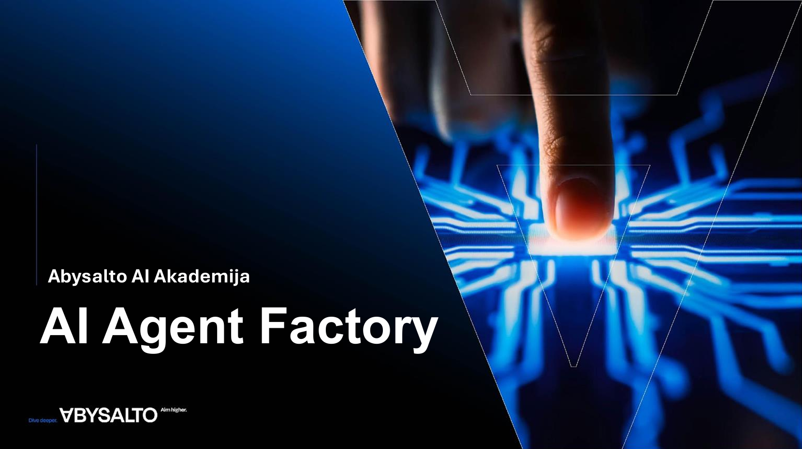
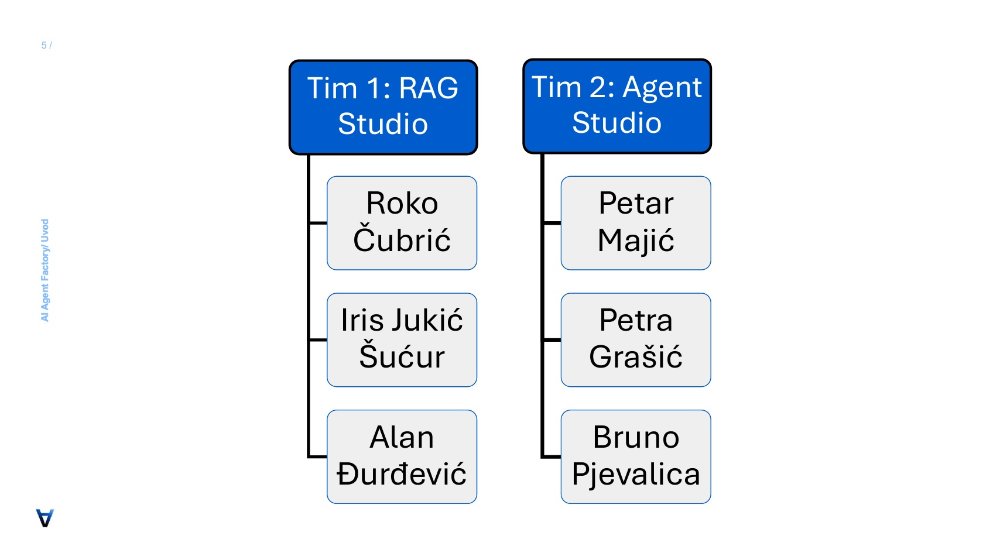
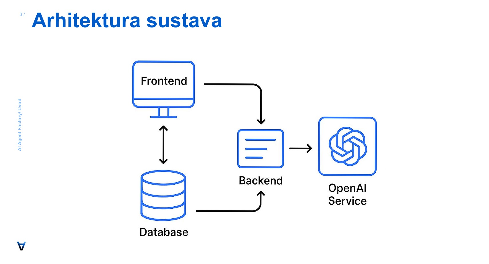
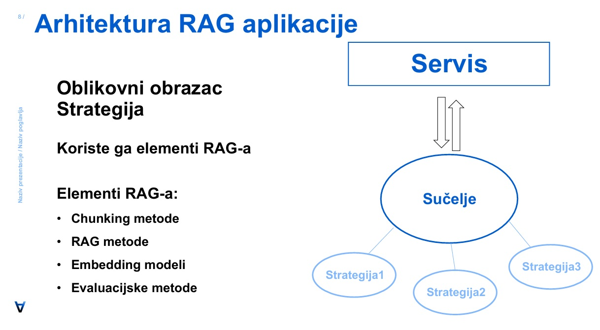
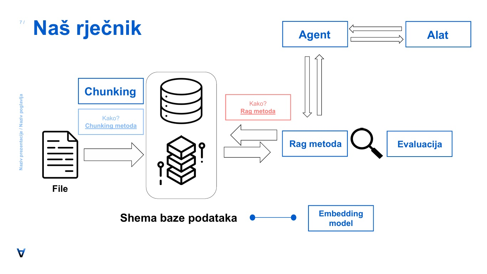
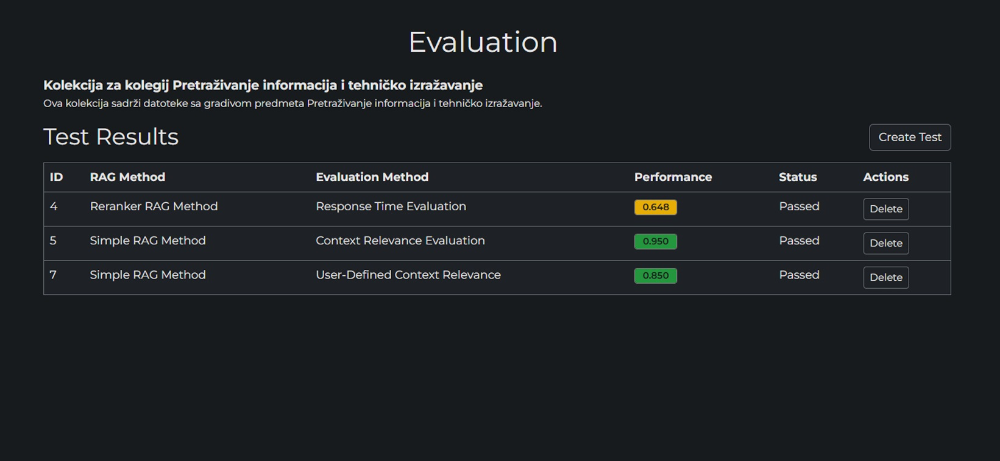

# AI Agent Factory: Intelligent Document Processing Platform (Internship Project Showcase)

This repository serves as a detailed showcase of the comprehensive AI Agent and Retrieval-Augmented Generation (RAG) platform I co-developed during my summer 2025 internship at Abysalto. The platform is designed to create, configure, and deploy specialized AI agents capable of intelligent document processing and complex reasoning.

**Note:** The source code for this project is proprietary to Abysalto and cannot be shared publicly. This repository serves as a detailed portfolio piece to document the project's architecture, my technical contributions, and the results achieved.

  

---

### My Role & Key Contributions

  
   
  <em>Official team structure from our final presentation, highlighting my role on the RAG Studio team.</em>

As an AI Academy Intern, I was deeply involved in the entire development lifecycle. I played an integral role in architectural design and hands-on implementation, focusing on building a system that was not just functional but also scalable, reliable, and extensible.

*   **System Architecture:** I took a leading role in key architectural decisions, championing the use of the **Strategy design pattern** to create a modular system. This allowed for pluggable components for RAG methods, document chunking, and evaluation, which accelerated our experimentation cycles by **3x**.
*   **RAG System Implementation:** I designed and implemented an extensible Retrieval-Augmented Generation (RAG) system, developing several of the nine specialized retrieval methods. This core system achieved **95%+ retrieval precision** in our internal testing benchmarks.
*   **API & Microservices:** I developed robust microservices using Python and FastAPI, creating over 50 RESTful endpoints for comprehensive system control, from document ingestion to agent interaction.
*   **Database Optimization:** I optimized PostgreSQL queries and designed dynamic table generation logic that automatically adapted to different embedding model dimensions, ensuring efficient vector operations with `pgvector`.

---

### Technical Deep Dive: Architecture & Design

The platform was built with a focus on modern software architecture and cutting-edge AI techniques.

#### 1. High-Level System Architecture

The system follows a standard three-tier architecture, with a clear separation between the frontend, a robust backend handling all business logic, and the database. The backend also acts as an orchestration layer for external services like the OpenAI API.

  

#### 2. The Strategy Design Pattern

A core architectural decision was the extensive use of the Strategy pattern (*Oblikovni obrazac Strategija*). This diagram shows how the main Service (*Servis*) uses a common Interface (*Sučelje*) to interact with interchangeable strategies (*Strategija1, 2, 3*). This decoupled the core logic from specific implementations of our RAG and chunking methods, making the system incredibly flexible.

  
   
  <em>Diagram illustrating how the Strategy pattern was applied to the core components of the RAG system.</em>

#### 3. Advanced Retrieval-Augmented Generation (RAG) System

The core of the project was its sophisticated and highly modular RAG system. The diagram below, from our final presentation, illustrates the complete data lifecycle from document ingestion to agent response.

  
   
  <em>This diagram, titled 'Our Glossary' (<b>Naš rječnik</b>), shows the full workflow. A <b>File</b> is processed via a selected <b>Chunking</b> method (<b>Chunking metoda</b>) and stored in the database (<b>Shema baze podataka</b>), which is created using an <b>Embedding model</b>. On retrieval, a query is handled by a specific <b>RAG Method</b> (<b>Rag metoda</b>), with its performance measured by an <b>Evaluation</b> (<b>Evaluacija</b>) process. The entire system is orchestrated by an <b>Agent</b> which can also leverage external tools (<b>Alat</b>).</em>

This architecture allowed for a high degree of control and optimization at each step:

*   **Multi-Vector Embeddings:** We stored separate embeddings for document content, generated summaries, and potential questions. This approach, visible in the `Shema baze podataka` (Database Schema) component, enabled more nuanced and accurate semantic search.

*   **Specialized Retrieval Methods:** The system featured nine distinct retrieval strategies (*RAG metode*), allowing users to select the optimal method for their specific use case. These included strategies like `Multi-Query RAG` (using LLMs for query expansion), `Hybrid Meta RAG` (combining semantic search with keyword filtering), and `Graph-Walk RAG` (exploring relationships between document chunks).
---

### Project in Action: User Interface

While my focus was on the backend, our team developed a comprehensive UI for configuration and testing. Below is a screenshot of the Evaluation dashboard, which allowed us to benchmark the performance and relevance of different RAG method configurations.

  
   
  <em>The test results dashboard, showing performance metrics for different RAG methods.</em>

---

### Tech Stack

*   **Backend:** Python, FastAPI, SQLAlchemy
*   **AI/ML:** LangChain, LangGraph, OpenAI API
*   **Database:** PostgreSQL with pgvector extension
*   **Frontend:** React, Bootstrap
*   **Infrastructure:** Docker
